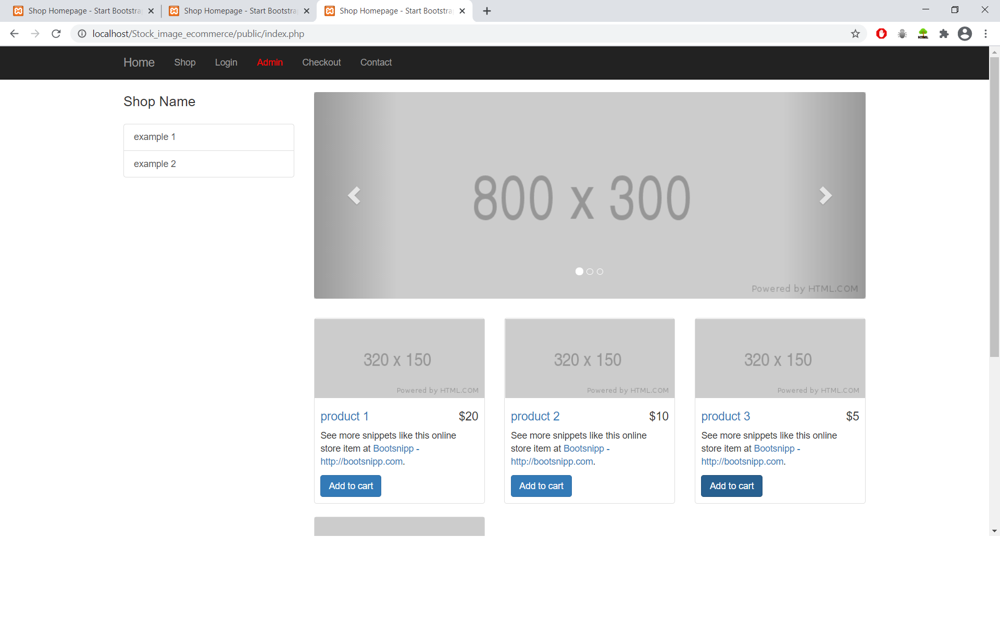
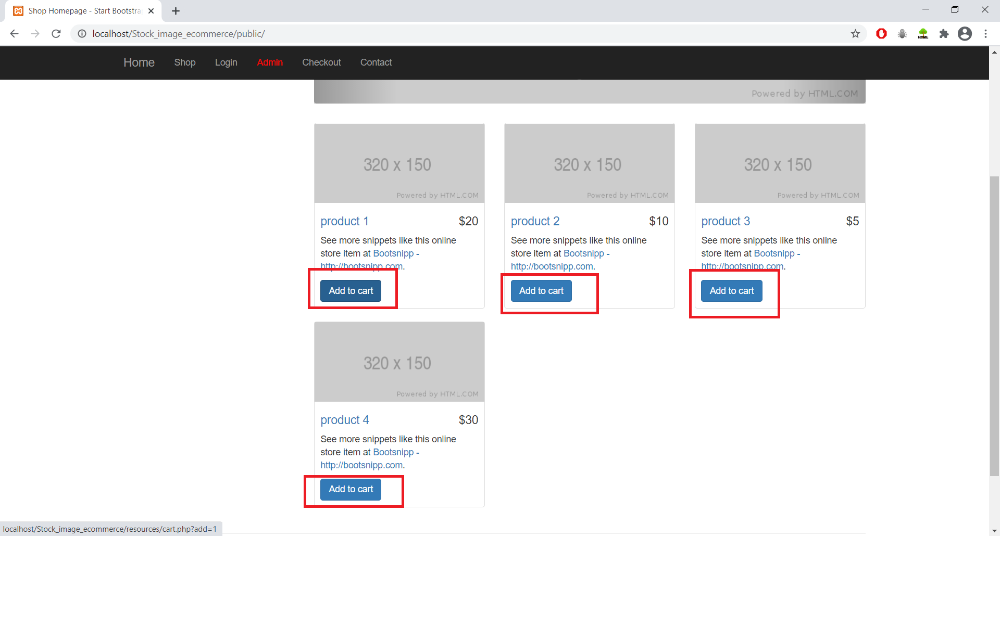
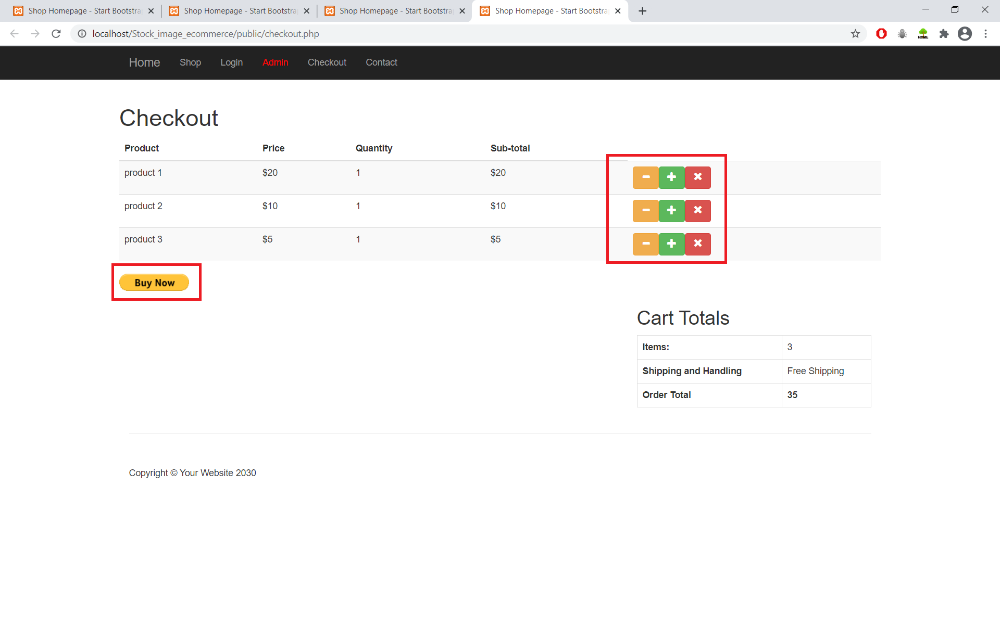
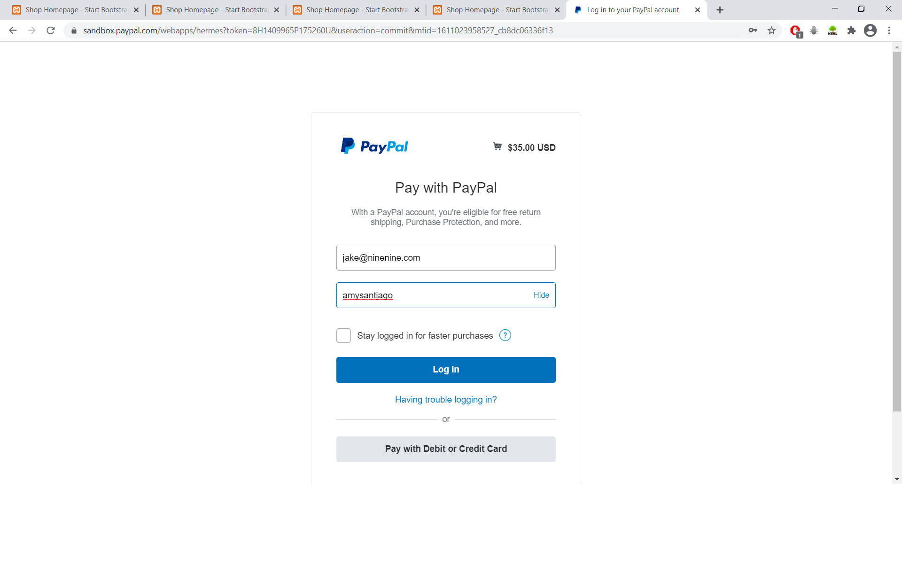
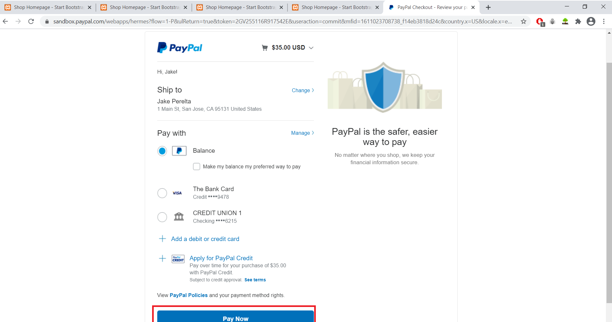
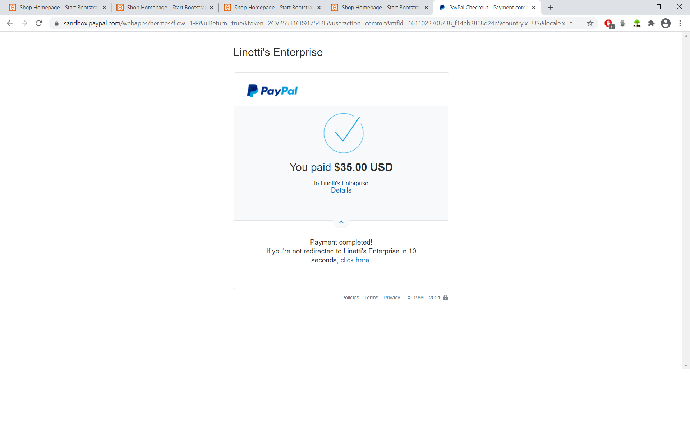
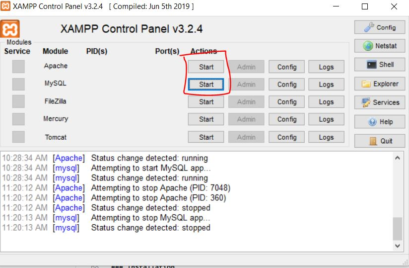

# Stock_image_ecommerce

<!-- TABLE OF CONTENTS -->
<details open="open">
  <summary>Table of Contents</summary>
  <ol>
    <li>
      <a href="#about-the-project">About The Project</a>
      <ul>
        <li><a href="#built-with">Built With</a></li>
        <li><a href="#payment-processing-demo-screenshots">Payment Processing Demo Screenshots</a></li>
      </ul>
    </li>
    <li>
      <a href="#getting-started">Getting Started</a>
      <ul>
        <li><a href="#prerequisites">Prerequisites</a></li>
        <li><a href="#usage">Usage</a></li>
      </ul>
    </li>
  </ol>
</details>


<!-- ABOUT THE PROJECT -->
## About The Project

### Built With

* PHP
* MySQL
* Javascript

### Payment Processing Demo Screenshots

<ul>
  <li>This is the landing page.  
  </li>
  <li>Select any products to add in the cart.  
  </li>
  <li>You can increment/decrement/delete any product. The total price will be reflected accordingly.  
    When you are ready to submit your purchases, click "Buy Now".  
  </li>
  <li>Next, to complete the purchases, you can enter the following credentials provided.  
  </li>
  <li>You will be brought to the payment options page to enter your mode of payment  
  </li>
  <li>After confirming your payment, you will be shown this page for 5 seconds before redirecting you back to the homepage of the ecommerce website.  
  </li>
</ul>

 

## Getting Started

### Prerequisites

You would need to install XAMPP software in order to set up a web server.  .
* XAMPP homepage
  ```sh 
  https://www.apachefriends.org/index.html
  ```
### Usage

1. Clone the repo
   ```sh
   git clone https://github.com/francelow/Stock_image_ecommerce.git
   ```
2. Once you have finished cloning the repo, go inside the Stock_image_ecommerce folder and cut the ecom_db folder and move it into the mysql/data folder.

3. Once ecom_db has been moved, move the Stock_image_ecommerce folder into the htdocs folder inside your xampp folder. 
   
4. Initialize your XAMPP program, and start both the Apache and MySQL like so:


5. Once both the Apache and MySQL have been booted up, go to your browser and enter "http://localhost/Stock_image_ecommerce/public/", which will bring you to the homepage of the website.
